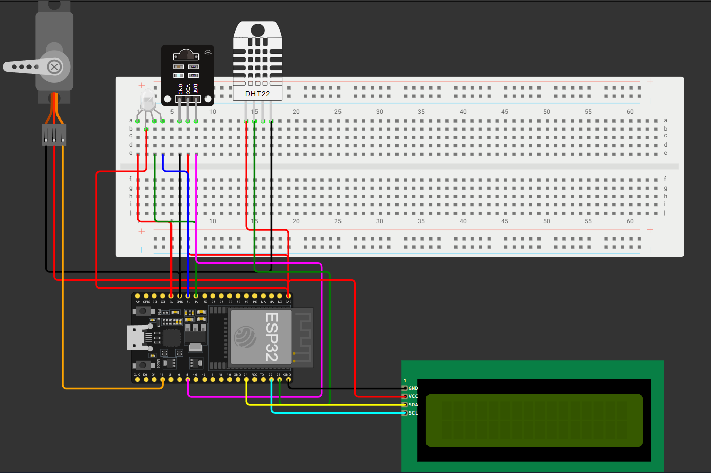
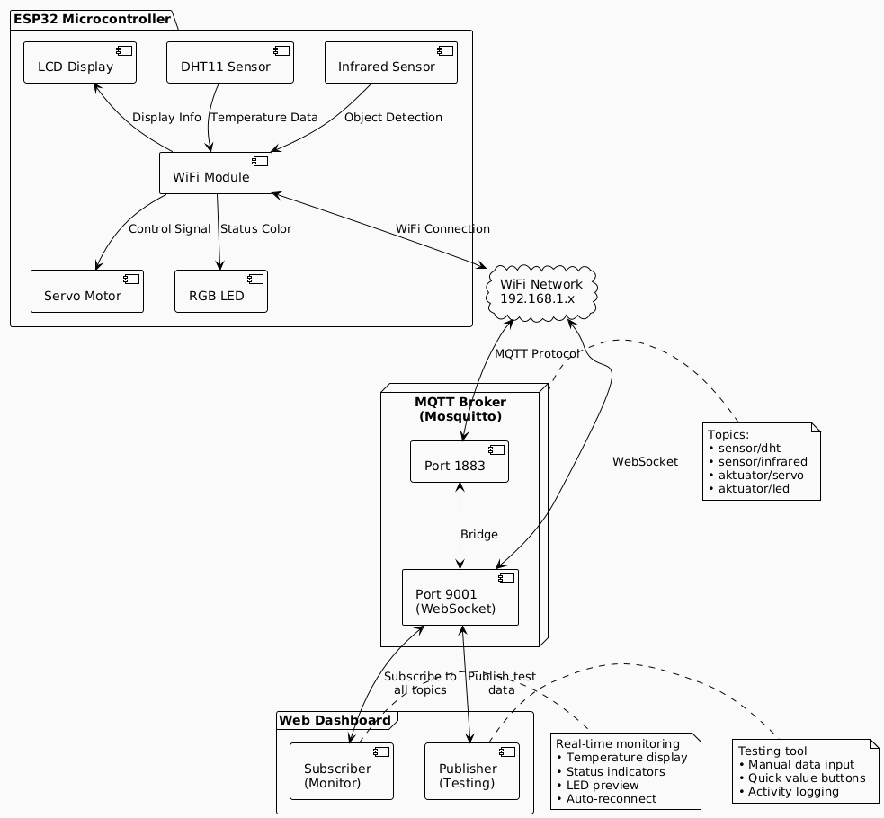
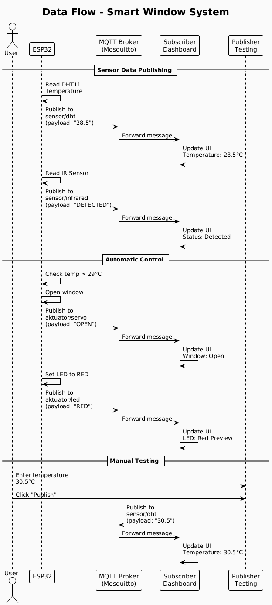
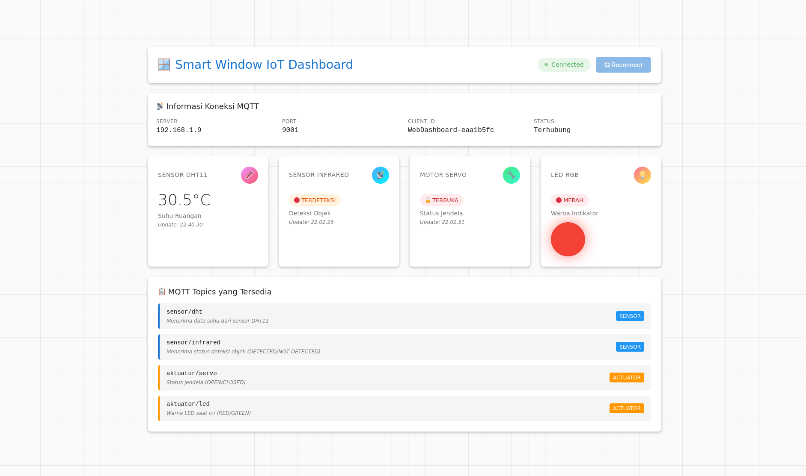
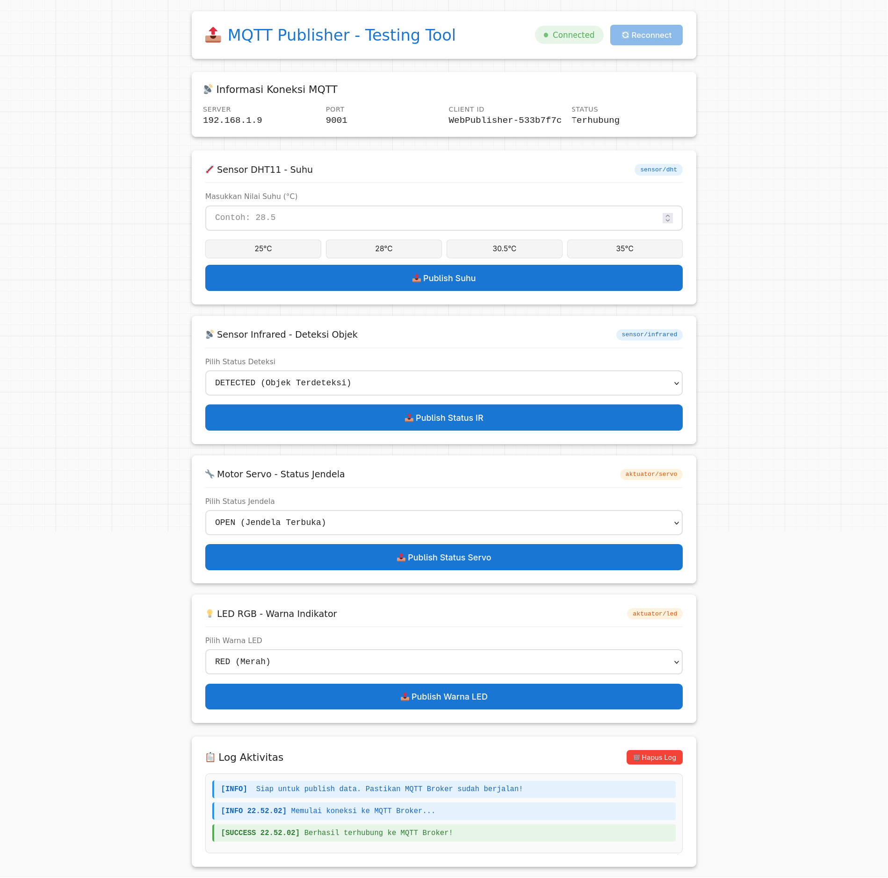
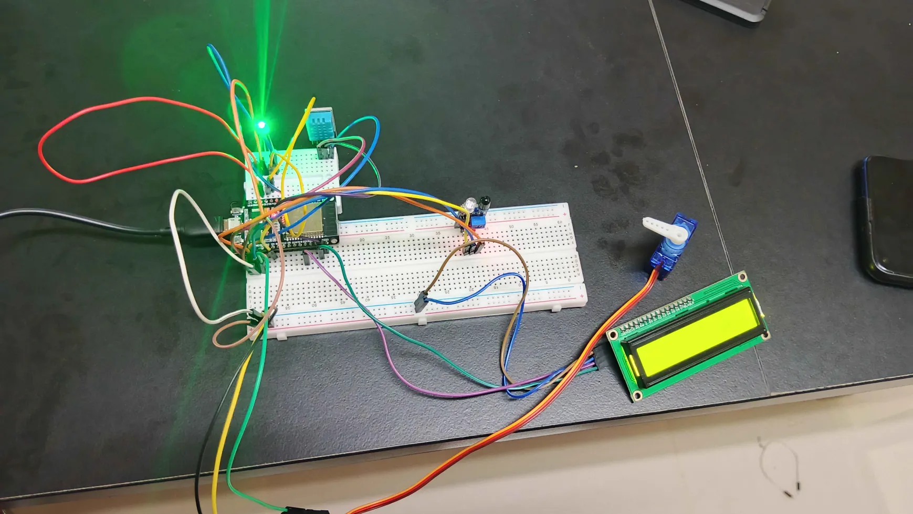
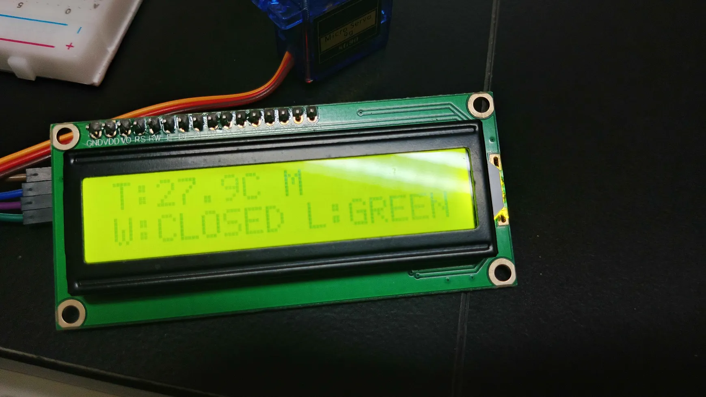

# Smart Window IoT System

An IoT-based smart window automation system that monitors environmental conditions and automatically controls window opening/closing based on temperature readings and object detection using MQTT protocol.

## Table of Contents
- [System Overview](#system-overview)
- [Hardware & Software](#hardware--software)
- [Wiring Diagram](#wiring-diagram)
- [System Architecture](#system-architecture)
- [MQTT Topics & Payloads](#mqtt-topics--payloads)
- [Installation Guide](#installation-guide)
- [How to Use](#how-to-use)
- [Testing & Operation](#testing--operation)
- [Dashboard Screenshots](#dashboard-screenshots)
- [Device Photos](#device-photos)
- [Troubleshooting](#troubleshooting)

---

## System Overview

The **Smart Window IoT System** is an automated window control solution designed for smart homes. The system integrates environmental sensors and actuators to intelligently manage window operations based on real-time data.

### How It Works

1. **Temperature Monitoring**: DHT11 sensor continuously reads room temperature
2. **Object Detection**: Infrared sensor detects objects near the window
3. **Automatic Control**: When temperature exceeds 29°C, the servo motor automatically opens the window
4. **Visual Feedback**: RGB LED indicates system status (Green = Normal, Red = High Temperature)
5. **Real-time Dashboard**: Web-based dashboard displays all sensor data and allows manual control
6. **MQTT Communication**: All devices communicate through MQTT broker for real-time data exchange

---

## Hardware & Software

### Hardware Components

| Component | Model/Type | Quantity | Function |
|-----------|-----------|----------|----------|
| Microcontroller | ESP32 | 1 | Main controller & WiFi connectivity |
| Temperature Sensor | DHT11 | 1 | Measures room temperature |
| Infrared Sensor | IR Obstacle Sensor | 1 | Detects object presence |
| Servo Motor | SG90/MG996R | 1 | Controls window opening/closing |
| RGB LED | Common Cathode | 1 | Visual status indicator |
| LCD Display | I2C LCD 16x2 | 1 | Local display on device |
| Jumper Wires | - | As needed | Connections |
| Breadboard | - | 1 | Component mounting |
| Power Supply | 5V USB/Adapter | 1 | Power source |

### Software & Tools

| Software | Version | Purpose |
|----------|---------|---------|
| Arduino IDE | 1.8.19+ | ESP32 programming |
| Mosquitto | 2.0.22+ | MQTT broker |
| Web Browser | Latest | Dashboard access |
| Git | Latest | Version control |

### Required Arduino Libraries

```cpp
- WiFi.h (ESP32 built-in)
- PubSubClient (MQTT client)
- DHT (DHT sensor)
- Servo (Servo motor control)
- LiquidCrystal_I2C (LCD display)
- Wire.h (I2C communication)
```

---

## Wiring Diagram



### Pin Configuration

| Component | ESP32 Pin | Notes |
|-----------|-----------|-------|
| DHT11 | GPIO 23 | Data pin |
| Infrared Sensor | GPIO 4 | Digital output |
| Servo Motor | GPIO 15 | PWM control |
| LED Red | GPIO 13 | PWM capable |
| LED Green | GPIO 14 | PWM capable |
| LED Blue | GPIO 12 | PWM capable |
| LCD SDA | GPIO 21 | I2C data |
| LCD SCL | GPIO 22 | I2C clock |

---

## System Architecture

### Application Architecture



### Data Flow Diagram (PlantUML)



---

## MQTT Topics & Payloads

### Topic Structure

| Topic | Type | Direction | QoS | Retain |
|-------|------|-----------|-----|--------|
| `sensor/dht` | Sensor | ESP32 → Broker | 0 | false |
| `sensor/infrared` | Sensor | ESP32 → Broker | 0 | false |
| `aktuator/servo` | Actuator | ESP32 → Broker | 0 | false |
| `aktuator/led` | Actuator | ESP32 → Broker | 0 | false |

### Payload Specifications

#### 1. sensor/dht
**Description**: Temperature readings from DHT11 sensor

**Payload Format**:
```
<float_temperature>
```

**Example**:
```json
28.5
30.2
25.0
```

**Unit**: Celsius (°C)

**Range**: 0.0 - 50.0

---

#### 2. sensor/infrared
**Description**: Object detection status from IR sensor

**Payload Format**:
```
DETECTED | NOT_DETECTED
```

**Example**:
```json
DETECTED
NOT_DETECTED
```

**Values**:
- `DETECTED` - Object is detected within sensor range
- `NOT_DETECTED` - No object in sensor range

---

#### 3. aktuator/servo
**Description**: Window status controlled by servo motor

**Payload Format**:
```
OPEN | CLOSED
```

**Example**:
```json
OPEN
CLOSED
```

**Values**:
- `OPEN` - Window is open (servo at 90°)
- `CLOSED` - Window is closed (servo at 0°)

---

#### 4. aktuator/led
**Description**: RGB LED color status

**Payload Format**:
```
RED | GREEN
```

**Example**:
```json
RED
GREEN
```

**Values**:
- `RED` - High temperature alert (temp > 29°C)
- `GREEN` - Normal temperature (temp ≤ 29°C)

---

## Installation Guide

### 1. Hardware Setup

1. **Connect Components** according to the wiring diagram
2. **Verify Connections** - Ensure all pins are properly connected
3. **Power Supply** - Connect ESP32 to 5V power source
4. **Test LCD** - LCD should light up when powered

### 2. Install Mosquitto MQTT Broker

#### On Arch Linux:

```bash
# Install Mosquitto
sudo pacman -S mosquitto

# Create/Edit configuration file
sudo nano /etc/mosquitto/mosquitto.conf
```

Add the following configuration:

```conf
# MQTT Protocol (for ESP32)
listener 1883
protocol mqtt

# WebSocket Protocol (for Web Dashboard)
listener 9001
protocol websockets

# Allow anonymous connections (for testing only)
allow_anonymous true

# Logging
log_type all
log_dest file /var/log/mosquitto/mosquitto.log
```

Start and enable Mosquitto service:

```bash
# Start service
sudo systemctl start mosquitto.service

# Enable auto-start on boot
sudo systemctl enable mosquitto.service

# Check status
sudo systemctl status mosquitto.service
```

#### On Windows:

1. Download Mosquitto from [mosquitto.org](https://mosquitto.org/download/)
2. Install with default settings
3. Edit `mosquitto.conf` in installation directory
4. Add the same configuration as above
5. Restart Mosquitto service from Services panel

#### On macOS:

```bash
# Install via Homebrew
brew install mosquitto

# Edit configuration
nano /usr/local/etc/mosquitto/mosquitto.conf

# Start service
brew services start mosquitto
```

### 3. Configure Network

1. **Find your computer's IP address**:

```bash
# Linux/macOS
ip addr show
# or
ifconfig

# Windows
ipconfig
```

2. **Note the IP address** (e.g., `192.168.1.9`)

3. **Ensure ESP32 and computer are on the same WiFi network**

### 4. Upload Code to ESP32

1. **Install Arduino IDE** from [arduino.cc](https://www.arduino.cc/en/software)

2. **Install ESP32 Board Support**:
   - Open Arduino IDE
   - Go to `File > Preferences`
   - Add to "Additional Board Manager URLs":
     ```
     https://raw.githubusercontent.com/espressif/arduino-esp32/gh-pages/package_esp32_index.json
     ```
   - Go to `Tools > Board > Boards Manager`
   - Search "ESP32" and install

3. **Install Required Libraries**:
   - Go to `Sketch > Include Library > Manage Libraries`
   - Install:
     - `PubSubClient` by Nick O'Leary
     - `DHT sensor library` by Adafruit
     - `Adafruit Unified Sensor`
     - `LiquidCrystal I2C` by Frank de Brabander

4. **Configure WiFi and MQTT**:

Edit in `smart_window.ino`:

```cpp
const char* ssid = "YourWiFiName";           // Replace with your WiFi SSID
const char* password = "YourWiFiPassword";   // Replace with your WiFi password
const char* mqtt_server = "192.168.1.9";     // Replace with your computer's IP
```

5. **Upload**:
   - Select `Tools > Board > ESP32 Dev Module`
   - Select correct Port
   - Click Upload button

### 5. Setup Web Dashboard

1. **Clone or download** this repository

2. **Update MQTT broker IP** in both HTML files:

**In `dashboard/subscriber/index.html`** and **`dashboard/publisher/index.html`**:

```javascript
const MQTT_CONFIG = {
    host: '192.168.1.9',    // Replace with your computer's IP
    port: 9001,
    // ...
};
```

3. **Open dashboards** in web browser:
   - Subscriber: `file:///path/to/dashboard/subscriber/index.html`
   - Publisher: `file:///path/to/dashboard/publisher/index.html`

---

## How to Use

### Starting the System

1. **Start Mosquitto Broker** (if not auto-started):
   ```bash
   sudo systemctl start mosquitto
   ```

2. **Power on ESP32** - Connect via USB or power adapter

3. **Wait for connection** - LCD will show "MQTT: Connected" when ready

4. **Open Subscriber Dashboard** in browser
   - Status badge should turn green "Connected"
   - Data will start appearing automatically

### Monitoring Data

The **Subscriber Dashboard** displays real-time data:

- **Temperature Card**: Current room temperature in °C
- **Infrared Card**: Object detection status
- **Servo Card**: Window open/close status
- **LED Card**: Visual indicator of current LED color

### Testing with Publisher

The **Publisher Testing Tool** allows manual data simulation:

1. Open Publisher dashboard in another browser tab
2. Select values to send (temperature, sensor status, etc.)
3. Click "Publish" button for each topic
4. Watch changes appear on Subscriber dashboard in real-time

### Automatic Operation

The system operates automatically based on these rules:

| Condition | Action | LED Status |
|-----------|--------|------------|
| Temperature > 29°C | Window opens | Red |
| Temperature ≤ 29°C | Window closes | Green |
| Object detected | Display alert on LCD | No change |

---

## Testing & Operation

### Test Scenarios

#### Scenario 1: Normal Temperature

**Steps**:
1. Ensure room temperature is below 29°C
2. Observe sensor readings on dashboard

**Expected Results**:
- Temperature displayed accurately
- Window status: CLOSED
- LED color: GREEN
- LCD shows: "Temp: XX.XC" and "Window: CLOSED"

#### Scenario 2: High Temperature

**Steps**:
1. Use Publisher to send temperature 30.5°C to `sensor/dht`
2. Observe system response

**Expected Results**:
- Dashboard updates to 30.5°C
- Window status changes to OPEN
- LED color changes to RED
- LCD shows: "Temp: 30.5C" and "Window: OPEN"

#### Scenario 3: Object Detection

**Steps**:
1. Use Publisher to send "DETECTED" to `sensor/infrared`
2. Check dashboard response

**Expected Results**:
- Infrared status shows "TERDETEKSI"
- LCD displays object detection message
- System continues normal operation

#### Scenario 4: Manual Control via Dashboard

**Steps**:
1. Open Publisher dashboard
2. Send different values to all topics
3. Monitor Subscriber dashboard updates

**Expected Results**:
- All published values appear on Subscriber dashboard
- Update timestamps are accurate
- No data loss or delays

### Command-Line Testing

You can also test using mosquitto command-line tools:

**Subscribe to all topics**:
```bash
mosquitto_sub -h localhost -t "sensor/#" -t "aktuator/#" -v
```

**Publish test data**:
```bash
# Test temperature
mosquitto_pub -h localhost -t "sensor/dht" -m "28.5"

# Test infrared
mosquitto_pub -h localhost -t "sensor/infrared" -m "DETECTED"

# Test servo
mosquitto_pub -h localhost -t "aktuator/servo" -m "OPEN"

# Test LED
mosquitto_pub -h localhost -t "aktuator/led" -m "RED"
```

---

## Dashboard Screenshots

### Subscriber Dashboard (Monitoring)



**Features**:
- Real-time temperature display with degree symbol
- Object detection status indicator
- Window status (Open/Closed)
- RGB LED color preview with visual indicator
- Connection status badge
- Auto-reconnect functionality
- Last update timestamps

### Publisher Dashboard (Testing)



**Features**:
- Manual input fields for all sensors
- Quick value buttons for temperature testing
- Dropdown menus for binary states
- Activity log with timestamps
- Publish buttons for each topic
- Connection status monitoring

---

## Device Photos





---

## Troubleshooting

### Issue 1: Dashboard Won't Connect

**Symptoms**: Status badge shows "Disconnected" in red

**Solutions**:

1. **Check Mosquitto service**:
   ```bash
   sudo systemctl status mosquitto
   ```
   Should show "active (running)"

2. **Verify IP address** matches in all files:
   - ESP32 code: `mqtt_server = "192.168.1.9"`
   - Subscriber HTML: `host: '192.168.1.9'`
   - Publisher HTML: `host: '192.168.1.9'`

3. **Check firewall**:
   ```bash
   sudo ufw allow 1883
   sudo ufw allow 9001
   ```

4. **Test local connection**:
   ```bash
   mosquitto_sub -h localhost -t "test" -v
   ```

---

### Issue 2: ESP32 Not Connecting to WiFi

**Symptoms**: LCD shows "WiFi: Connecting..." indefinitely

**Solutions**:

1. **Verify WiFi credentials** in code:
   ```cpp
   const char* ssid = "YourActualWiFiName";
   const char* password = "YourActualPassword";
   ```

2. **Check WiFi signal strength** - ESP32 should be close to router

3. **Restart ESP32** - Press reset button or re-plug USB

4. **Check Serial Monitor** (115200 baud) for error messages

---

### Issue 3: ESP32 Connects to WiFi but Not MQTT

**Symptoms**: LCD shows "WiFi: Connected" but "MQTT: Connecting..."

**Solutions**:

1. **Verify MQTT broker IP**:
   - Must match your computer's IP address
   - ESP32 and computer must be on same network

2. **Check Mosquitto is running**:
   ```bash
   sudo systemctl status mosquitto
   ```

3. **Test MQTT broker**:
   ```bash
   mosquitto_sub -h 192.168.1.9 -t "test" -v
   ```

4. **Check Mosquitto logs**:
   ```bash
   sudo tail -f /var/log/mosquitto/mosquitto.log
   ```

---

### Issue 4: Data Not Updating on Dashboard

**Symptoms**: Dashboard connected but shows old data or "No Data"

**Solutions**:

1. **Check ESP32 Serial Monitor** - Verify data is being published

2. **Test with mosquitto_sub**:
   ```bash
   mosquitto_sub -h localhost -t "sensor/#" -t "aktuator/#" -v
   ```

3. **Refresh browser** - Press F5 or Ctrl+R

4. **Check browser console** (F12) for JavaScript errors

---

### Issue 5: Servo Motor Not Moving

**Symptoms**: Dashboard shows window status changing but servo doesn't move

**Solutions**:

1. **Check power supply** - Servo needs sufficient current (use external 5V if needed)

2. **Verify servo connection**:
   - Signal wire to GPIO 15
   - Power to 5V
   - Ground to GND

3. **Test servo manually**:
   ```cpp
   // Add to loop() for testing
   myServo.write(0);   // Closed position
   delay(2000);
   myServo.write(90);  // Open position
   delay(2000);
   ```

---

### Issue 6: DHT11 Reading -999 or NaN

**Symptoms**: Temperature shows invalid values

**Solutions**:

1. **Check DHT11 connections**:
   - VCC to 3.3V
   - Data to GPIO 23
   - GND to GND

2. **Add pull-up resistor** (10kΩ) between VCC and Data pin

3. **Wait longer** - DHT11 needs 2 seconds between readings

4. **Replace sensor** - DHT11 may be faulty

---

### Issue 7: LCD Not Displaying

**Symptoms**: LCD backlight on but no text

**Solutions**:

1. **Adjust contrast** - Turn potentiometer on I2C module

2. **Check I2C address**:
   ```cpp
   // Try different addresses
   LiquidCrystal_I2C lcd(0x27, 16, 2);  // or
   LiquidCrystal_I2C lcd(0x3F, 16, 2);
   ```

3. **Verify I2C connections**:
   - SDA to GPIO 21
   - SCL to GPIO 22

4. **Run I2C scanner** to find correct address

---

### Issue 8: RGB LED Wrong Colors

**Symptoms**: LED shows wrong colors or doesn't light up

**Solutions**:

1. **Check LED type** (Common Cathode vs Common Anode)

2. **Verify pin connections**:
   - Red to GPIO 13
   - Green to GPIO 14
   - Blue to GPIO 12
   - Common to GND (for Common Cathode)

3. **Add current-limiting resistors** (220Ω for each color)

4. **Test individual colors**:
   ```cpp
   analogWrite(LED_RED_PIN, 255);    // Full red
   analogWrite(LED_GREEN_PIN, 255);  // Full green
   analogWrite(LED_BLUE_PIN, 255);   // Full blue
   ```

---

### General Debugging Tips

1. **Use Serial Monitor** - Add debug prints throughout code
   ```cpp
   Serial.println("Checkpoint reached");
   Serial.print("Temperature: ");
   Serial.println(temperature);
   ```

2. **Check all connections** - Loose wires are common issues

3. **Restart everything** in this order:
   - ESP32
   - Mosquitto service
   - Browser tabs

4. **Monitor MQTT traffic**:
   ```bash
   mosquitto_sub -h localhost -t "#" -v
   ```

5. **Check browser console** (F12) for errors

---

## Project Structure

```
smart-window-iot/
├── README.md                          # This documentation
├── mosquitto.conf                     # MQTT broker configuration
├── iot/
│   └── smart_window.ino              # ESP32 firmware
└── dashboard/
    ├── subscriber/
    │   ├── index.html                # Subscriber dashboard
    │   ├── styles.css                # Subscriber styles
    │   └── script.js                 # Subscriber logic
    └── publisher/
        ├── index.html                # Publisher testing tool
        ├── styles.css                # Publisher styles
        └── script.js                 # Publisher logic
```

---

## Contributing

This project was created as part of UTS Gasal 25/26 - Komunikasi Antar Perangkat.

**Team Members**:
- MUHAMMAD SATRIO
- MUHAMMAD FARRAS THOHARI RAMADHAN

---

## License

This project is created for educational purposes.

---

## References

- [ESP32 Documentation](https://docs.espressif.com/projects/esp-idf/en/latest/esp32/)
- [MQTT Protocol Specification](https://mqtt.org/)
- [Mosquitto Documentation](https://mosquitto.org/documentation/)
- [Arduino ESP32 Guide](https://github.com/espressif/arduino-esp32)

---

**Last Updated**: October 25, 2025
